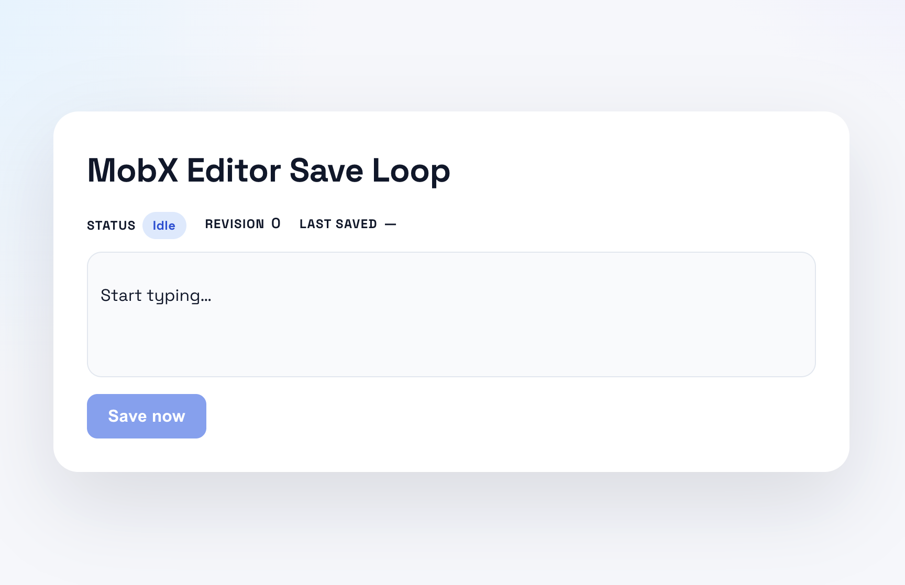
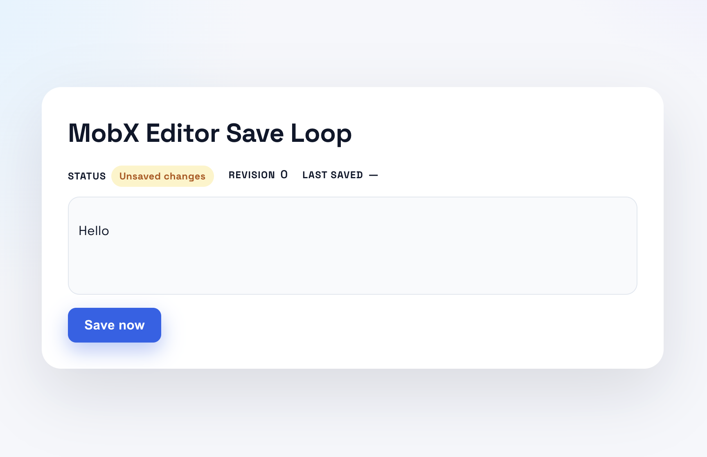

# Editor Save Loop

This project is a small React + TipTap editor that demonstrates a clean architectural split:

- **Functional core** for deterministic behavior and policy decisions.
- **Imperative shell** for orchestration and side effects.
- **Ports and adapters** for IO boundaries.
- **Projection** for mapping state to UI-friendly view data.
- **Errors as data** so failures become explicit, testable outcomes.

## Screenshots

Screenshots live in `src/assets`.

| Idle state | Unsaved changes | Saved state |
| --- | --- | --- |
|  |  |  |

## Architecture map

- **Functional core**: `src/core.ts`
  - Owns all state transitions via `reduceDoc`.
  - Enforces policy (e.g., max document size).
  - Produces deterministic state from events.

- **Projection**: `src/projection.ts`
  - Converts core state into UI-facing labels and flags.
  - Keeps view logic out of components.

- **Imperative shell**: `src/docStore.ts`
  - Coordinates workflows (save flow, cancellation).
  - Measures document size and passes it as data to the core.
  - Calls ports only when the core allows it.

- **Ports**: `src/ports.ts`
  - Contract for IO (`save` returns `SaveResult`).

- **Adapter**: `src/adapter.ts`
  - Fake implementation of the port (simulated latency).
  - Returns success or error data, never throws.

- **UI**: `src/App.tsx`, `src/App.css`, `src/index.css`
  - Renders the projected view.
  - Uses explicit "Save now" action; no autosave.

## Save flow (event-driven)

1) Editor change -> shell dispatches `DOC_CHANGED`.
2) User clicks Save -> shell measures doc size.
3) Shell dispatches `SAVE_REQUESTED` with `docSizeBytes`.
4) Core decides if saving is allowed (policy guard).
5) If allowed, shell calls the port adapter.
6) Port returns `SaveResult` -> shell dispatches `SAVE_SUCCEEDED` or `SAVE_FAILED`.
7) Projection turns state into UI labels and badges.

## Why this approach

- **Determinism**: All behavior is in the core reducer.
- **Testability**: Core transitions are pure and easy to unit test.
- **Clarity**: Shell does orchestration; adapters do IO.
- **Explicit errors**: No thrown exceptions; failures are data.
- **Swappable IO**: Replace adapters without touching behavior.

## Development

- Install: `npm install`
- Run: `npm run dev`

## Architecture links

- <https://www.0xjcf.com/writing/when-code-becomes-cheap/>

The project is intentionally small so the architecture is easy to see and reason about.
