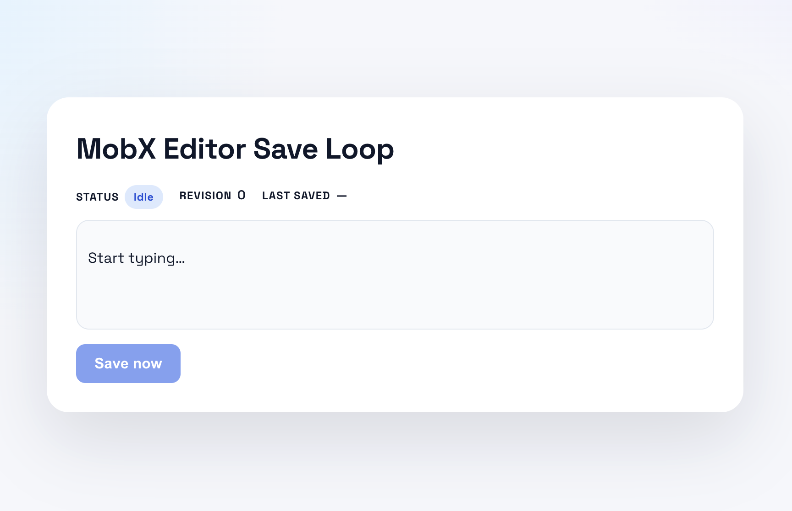
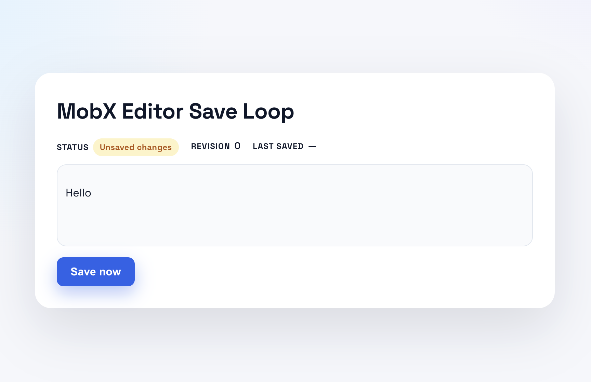

# Editor Save Loop

> Run the full system in the browser — no local setup required.

This project is a small React + TipTap editor that demonstrates a clean architectural split:

* **Functional core** for deterministic behavior and policy decisions.
* **Imperative shell** for orchestration and side effects.
* **Ports and adapters** for IO boundaries.
* **Projection** for mapping state to UI-friendly view data.
* **Errors as data** so failures become explicit, testable outcomes.

## Screenshots

Screenshots live in `src/assets`.

| Idle state                         | Unsaved changes                            | Saved state                          |
| ---------------------------------- | ------------------------------------------ | ------------------------------------ |
|  |  |  |

## Architecture map

* **Functional core**: `src/core.ts`

  * Owns all state transitions via `reduceDoc`.
  * Enforces policy (e.g., max document size).
  * Produces deterministic state from events.

* **FSM (visual workflow)**: `src/docMachine.ts`

  * Pure state machine for workflow visualization.
  * Receives events emitted by the core reducer.

* **Projection**: `src/projection.ts`

  * Converts core state into UI-facing labels and flags.
  * Keeps view logic out of components.

* **Lifecycle store (core + FSM)**: `src/docStore.ts` (DocStore)

  * Holds state over time.
  * Applies the reducer and forwards emits to the FSM (with legality checks).
  * Does **not** perform I/O.

* **Imperative shell (orchestrator)**: `src/docStore.ts` (DocShell)

  * Coordinates time, cancellation, and port calls.
  * Measures document size and passes it as data to the core.
  * Receives only facts from adapters and forwards them to the lifecycle.

* **Ports**: `src/ports.ts`

  * Contract for IO (`save` returns `SaveResult`).

* **Adapter**: `src/adapter.ts`

  * Fake implementation of the port (simulated latency).
  * Returns success or error data, never throws.

* **UI**: `src/App.tsx`, `src/App.css`, `src/index.css`

  * Renders the projected view.
  * Uses explicit "Save now" action; no autosave.

## Save flow (event-driven)

1. Editor change -> shell maps unknown input to `DOC_CHANGED` or `DOC_INVALID`.
2. User clicks Save -> shell measures doc size and dispatches `SAVE_REQUESTED`.
3. Core decides if saving is allowed and emits lifecycle events to the FSM.
4. Shell calls the port adapter only when the FSM is in `saving`.
5. Port returns a typed `SaveResult` (including `aborted` as a fact).
6. Shell dispatches `SAVE_COMPLETED` fact back into the core.
7. Projection turns data + FSM state into UI labels and actions.

## Why this approach

* **Determinism**: All behavior is in the core reducer.
* **Testability**: Core transitions are pure and easy to unit test.
* **Clarity**: Shell does orchestration; adapters do IO.
* **Explicit errors**: No thrown exceptions; failures are data.
* **Swappable IO**: Replace adapters without touching behavior.

## Development

* Install: `npm install`
* Run: `npm run dev`

## Architecture links

* [https://www.0xjcf.com/writing/when-code-becomes-cheap/](https://www.0xjcf.com/writing/when-code-becomes-cheap/)

The project is intentionally small so the architecture is easy to see and reason about.
